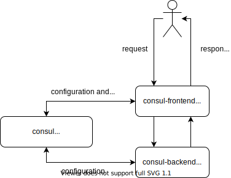

# k8s Consul example
This project is simple demo of microservice application using 
[Spring-cloud-consul](https://cloud.spring.io/spring-cloud-consul/reference/html/) + [consul.io](https://consul.io)

This project is __WIP__ !

## Run on localhost


* download and install [consul](https://releases.hashicorp.com/consul/1.7.0/consul_1.7.0_linux_amd64.zip)
  ```
  unzip consul_1.7.0_linux_amd64.zip
  ```
* start local consul instance at [http://localhost:8500](http://127.0.0.1:8500/)
  ```
  # start consul in development mode
  ./consul agent -dev
  # or start single node consul server agent
  ./consul agent -server -ui=true -bootstrap-expect=1 -bind=127.0.0.1 -data-dir=data-node-0
  ```
* create consul key/value configurations for frontend and backend
  ```
  Key: /config/myConsulFrontendApp/my/prop Value: value-from-consul
  Key: /config/myConsulBackendApp/my/prop Value: value-from-consul
  ```
* build project
  ```
  gradle clean build
  ```  
* start consul-frontend application
  ```
  java -jar consul-frontend/build/libs/consul-frontend-1.0.0-SNAPSHOT.jar 
  ```
* try consul-frontend application endpoints
  ```
  GET http://localhost:8080/services/data
  GET http://localhost:8080/services/health
  ```
* start consul-backend application
  ```
  java -jar consul-frontend/build/libs/consul-backend-1.0.0-SNAPSHOT.jar 
  ```
* try consul-backend application endpoints
  ```
  GET http://localhost:8081/services/data
  GET http://localhost:8081/services/health  
  