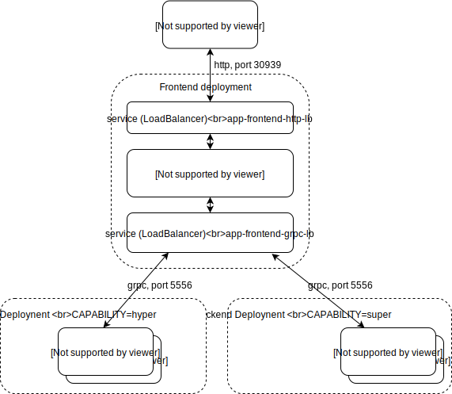

# Multi-layer application
This is example of multi-layer application deployment into kubernetes.
1. __Frontend layer__ - gets request from http client and forwards it to appropriate worker backend.
2. __Backend layer__ - consists from pool of workers, each worker has certain capability.

### Architecture


### Build and run
Build and run on local machine.
```
gradle clean installDist 
./app-frontend/build/install/app-frontend/bin/app-frontend
./app-backend/build/install/app-backend/bin/app-backend
```

### Build docker images
```
docker build . -f app-frontend/Dockerfile -t app-frontend:1.0.0-SNAPSHOT
docker build . -f app-backend/Dockerfile -t app-backend:1.0.0-SNAPSHOT
docker save --output="app-frontend/build/app-frontend:1.0.0-SNAPSHOT.tar" app-frontend:1.0.0-SNAPSHOT
docker save --output="app-backend/build/app-backend:1.0.0-SNAPSHOT.tar" app-backend:1.0.0-SNAPSHOT
```
### REST APIs
* get multi-layer app status  
  ``curl -X GET http://127.0.0.1:8080/status``
* process request  
  ``curl -d '{ "id": 1234, "data": { "typeId": "java.lang.String", "data": "xxx" }, "capability": "super" }' -X POST http://127.0.0.1:8080/exec``
* get capabilities of multi-layer app  
  ``curl -X GET http://127.0.0.1:8080/capabilities``

### k8s deployment
* Deploy one frontend layer and multiple backend layers. 
* One backend layer has 'super' capability, the other one has 'hyper' capability.
* Frontend layer is able to respond to requests with capability 'super' or 'hyper'.
* Frontend grpc service is available as hostname __app-frontend-grpc-lb.default.svc.cluster.local__
```
# deploy frontend layer
kubectl apply -f app-frontend-deployment.yaml 

# deploy backend layer with 'super' capability
kubectl apply -f app-backend-super-deployment.yaml
 
# deploy backend layer with 'hyper' capability
kubectl apply -f app-backend-hyper-deployment.yaml 
```
Horizontal up/down scaling: Only backend deployments are designed for horizontal scaling !
```
# scale up
kubectl scale deployment app-backend-super --replicas=5
kubectl scale deployment app-backend-hyper --replicas=5

# scale down
kubectl scale deployment app-backend-super --replicas=2
kubectl scale deployment app-backend-hyper --replicas=2
```

Undeploy multi-layer application
```
# undeploy frontend layer
kubectl delete service/app-frontend-grpc-lb service/app-frontend-http-lb deployment.apps/app-frontend

# undeploy backend layer with 'super' capability
kubectl delete deployment.apps/app-backend-super service/app-backend-super

# undeploy backend layer with 'hyper' capability
kubectl delete deployment.apps/app-backend-hyper service/app-backend-hyper
```

