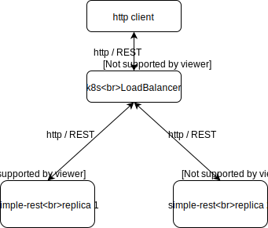

# Simple stateless REST service
This is simple demo of stateless REST service.
it responds to simple GET requests.

### Build and run
Build and run on local machine.
```
gradle clean build 
java -jar build/libs/service-simple-rest-1.0.0-SNAPSHOT.jar
```

### Build Docker image 
```
docker build . -t service-simple-rest:1.0.0-SNAPSHOT
docker image list
docker save --output="build/service-simple-rest:1.0.0-SNAPSHOT.tar" service-simple-rest:1.0.0-SNAPSHOT
docker image rm -f <imageid>
docker run -p 8888:8080 service-simple-rest:1.0.0-SNAPSHOT
```

## k8s deployment

K8s deploy sequence:
```
kubectl apply -f service-simple-rest-deployment.yaml
kubectl logs service-simple-rest-<podId> 
```
This deploys two instances of REST service behind single __load balancer__.
Load-balanced service is accessible master kubernetes node using URL:
```
for i in {1..1000}; do
   curl -X GET http://<kube-master>:30081/data/info
   echo ""
done   
``` 
K8s undeploy sequence:
```
kubectl delete service/service-simple-rest
kubectl delete deployment.apps/service-simple-rest
```

### REST endpoints
* __GET__ ``http://hostname:port/data/info``
* __GET__ ``http://hostname:port//data/compute/pi/{precision}``

```
curl -X GET http://localhost:8080/data/info
curl -X GET http://localhost:8080/data/compute/pi/{precision}
``` 
where precision is in range 0 .. 10, 10 is max. precision
