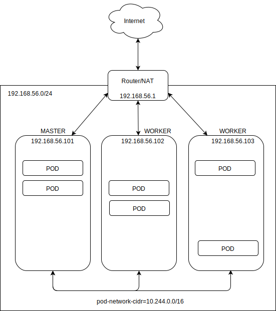

# Kubernetes cluster setup
How to setup kubernetes cluster. This 10-minute guide is crafted for Ubuntu Server 18.04.4 LTS based on [this](https://www.linuxtechi.com/install-configure-kubernetes-ubuntu-18-04-ubuntu-18-10/) and
[this](https://kubernetes.io/docs/setup/independent/create-cluster-kubeadm/#pod-network) manuals.

### Network topology
Assuming all kubernetes cluster nodes are on same network __192.168.56.0/24__.
Assuming kubernetes __master node__ at __192.168.56.101__ and __workers__ at __192.168.56.102, 192.168.56.103, ...__

All nodes are visible amongst each other. IP addresses of the nodes does not change after k8s installation.
This network setup is suitable for bare metal installation an well as installation in VirtualBox.



### VirtualBox networking setup
In case running all 3 nodes as VMs on VirtualBox, following setup is recommended:
* each VM has exactly one network interface
* network adapter is setup using "Host-only adapter" vboxnet0
* using VirtualBox global tools -> Host Network manager and make sure vboxnet0 
  network 192.168.56.1/24 is created.
* if DHCP is on, once make sure that assigned IP addresses does not change for VMs once assigned.
* if DHCP is off, use statically assigned IP addresses.
* use NAT setup to provide inetrnet access for k8s nodes.

### Execute on all nodes
This is basic node setup for all kubernetes cluster nodes (master and all workers).
Assuming bare Ubuntu Server 18.04.4 LTS was installed with ssh server.
```
sudo apt-get install docker.io -y
sudo systemctl start docker
sudo systemctl enable docker
sudo apt-get install apt-transport-https curl -y
curl -s https://packages.cloud.google.com/apt/doc/apt-key.gpg | sudo apt-key add
sudo apt-add-repository "deb http://apt.kubernetes.io/ kubernetes-xenial main"
sudo swapoff -a	
#disable swap by editing /etc/fstab, so it remains disabled after reboot
sudo apt-get install kubeadm -y
#add normal user on node into docker group
```

### Execute on master node
Setup master. Init kubernetes master node, use flannel networking:
```
sudo kubeadm init --pod-network-cidr=10.244.0.0/16 --apiserver-advertise-address=<IP-ADDR-API>
```
Where __IP-ADDR-API__ is for example 192.168.56.101. WARN: API server address MUST NOT belong to network POD CIDR !

Last __kubeadm init__ command prints out token and token CA cert hash. Save those for worker node setup.
Token and CA cert hash can be displayed at any time on master node using command:
```
sudo kubeadm token create --print-join-command
```

As regular user, finish the setup:
```
mkdir -p $HOME/.kube
sudo cp -i /etc/kubernetes/admin.conf $HOME/.kube/config
sudo chown $(id -u):$(id -g) $HOME/.kube/config

kubectl apply -f https://raw.githubusercontent.com/coreos/flannel/a70459be0084506e4ec919aa1c114638878db11b/Documentation/kube-flannel.yml
```
Setup kubectl autocomplete
```
source <(kubectl completion bash) # setup autocomplete in bash into the current shell, bash-completion package should be installed first.
echo "source <(kubectl completion bash)" >> ~/.bashrc # add autocomplete permanently to your bash shell.
```

### Attach worker nodes
On each worker node, run __kubeadm join__ like example below. You will get exact token values from previous run of __kubeadm init__ on master node.
```
sudo kubeadm join 192.168.56.101:6443 --token <actual-token> --discovery-token-ca-cert-hash sha256:<actual-hash>
```

### Check cluster status
Check if nodes (cluster is running properly) on master.
```
sudo kubectl get nodes
sudo kubectl get pods --all-namespaces
```

## Other useful tips
* [How to reset cluster setup](docs/ResetK8sClusterSetup.md)
* [How to setup Web UI dashboard](docs/SetupWebDashboard.md)
* [How to import and manage custom docker image](docs/CustomImages.md)
* [How to create and manage custom deployment](docs/CustomDeployment.md) 
* [Minikube how-to](docs/MinikubeHowTo.md)
